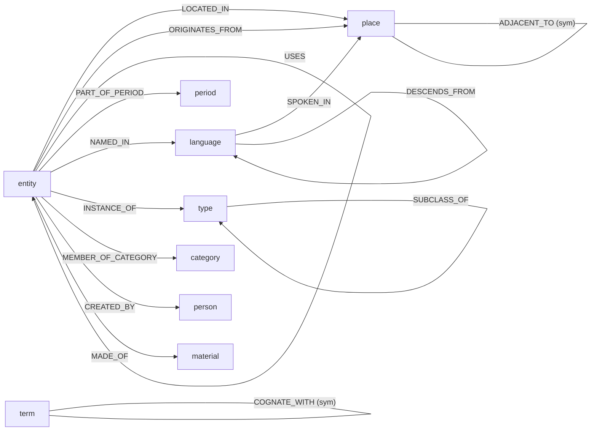

# Cross-Dimensional Ontology

The relationship vocabulary that turns a flat set of category nodes into a navigable
network, and the inference rules that produce each edge. This document is the prose
companion to the formal definitions in
[`src/culturescrape/ontology/registry.py`](../src/culturescrape/ontology/registry.py) —
the registry is the single source of truth, this page explains what each type
*means*, how it is *inferred*, and which test *exercises* the rule.

`tests/test_ontology_doc.py` keeps the two in sync: it fails if this document omits a
registered `:TYPE` or references a rule test that no longer exists.

## How edges are produced

Two kinds of edge exist in the graph:

- **Structural edges** are emitted during normalization, *before* linking. The
  categorizer ([`schema/categorize.py`](../src/culturescrape/schema/categorize.py))
  attaches every node to its category and its type node, so `INSTANCE_OF` and
  `MEMBER_OF_CATEGORY` are always present.
- **Inferred edges** are produced by the **linkers**
  ([`ontology/`](../src/culturescrape/ontology/)), one per cross-dimensional axis.
  Each linker reads the node and edge sets and returns *new* edges built with
  [`inferred_edge`](../src/culturescrape/ontology/linker.py) — which validates the
  `:TYPE` against the registry — stamped `source='inferred:<linker>'` and a
  confidence. The [`Pipeline`](../src/culturescrape/ontology/linker.py) runs linkers
  in order and never mutates the source rows; each linker sees the edges inferred
  before it, so inferences compose.

Every `:TYPE` carries the algebra a linker and the Datalog rules layer (Tasklist 5)
need:

- **symmetric** — the edge reads the same in both directions (`A REL B` ⇒ `B REL A`);
  the linkers emit a single canonical (`csid`-ordered) edge per pair.
- **transitive** — the edge chains (`A REL B` ∧ `B REL C` ⇒ `A REL C`); the rules
  layer materializes the closure.

## How the dimensions interconnect entities

Each dimension is a set of edge types over the node kinds (`:LABEL` tokens). The
diagram shows which kinds each type runs between — `entity` is the unconstrained
wildcard (a dish, sculpture, battle, …); the other kinds (`place`, `period`,
`language`, `term`, `type`, `category`, `person`, `material`) are the nodes the
linkers resolve, reuse, or mint.

A category becomes connected to the rest of the graph two ways: **shared entities**
(the same `csid` scraped under two categories is collapsed into one node by
[`stitch_categories`](../src/culturescrape/ontology/stitch.py), so both categories
reach it), and **cross-dimensional edges** (the linkers above, run by
`culturescrape link`).

## The vocabulary

Every registered `:TYPE`, its algebra, the rule that produces it, and the test that
exercises that rule. `dom → rng` is the domain/range as `:LABEL` tokens.

### Geographic — [`geographic.py`](../src/culturescrape/ontology/geographic.py)

| `:TYPE` | dom → rng | sym | trans | Inference rule | Test |
|---|---|:--:|:--:|---|---|
| `LOCATED_IN` | entity → place | | ✔ | Node's place id (`place_qid` / `tgn_id` / `pleiades_id`) resolves to a place node (reused or minted); a coordinate-only node attaches to the nearest place within `radius_km` at lower confidence. | `test_ontology_geographic.py::test_links_entity_to_existing_place_by_qid`, `::test_coords_only_attaches_to_nearest_place_with_lower_confidence` |
| `ORIGINATES_FROM` | entity → place | | | Same place resolution as `LOCATED_IN`, but the node's `:LABEL` is in `origin_labels`, so the place is its origin. | `test_ontology_geographic.py::test_origin_labels_emit_originates_from` |
| `SPOKEN_IN` | language → place | | | A language node's `place_qid`(s) resolve to place nodes (see linguistic linker). | `test_ontology_linguistic.py::test_spoken_in_links_language_to_places` |
| `ADJACENT_TO` | place ↔ place | ✔ | | Two places sharing a containing place (`place_qid`) are treated as neighbours; one canonical edge per pair. | `test_ontology_geographic.py::test_adjacent_to_between_places_sharing_a_container` |

### Temporal — [`temporal.py`](../src/culturescrape/ontology/temporal.py)

The linker mints only `PART_OF_PERIOD` (and the period nodes it links to). Since
T-SR-US-001 the pairwise `CONTEMPORARY_WITH`/`PRECEDES`/`FOLLOWS` relations are
**not materialised** — materialising every co-dated pair was quadratic (5.57M of
5.58M corpus edges) — they are derived on demand by the arithmetic Datalog rules
(`datalog/rules.py`: `contemporary`/`precedes`/`follows`) over the `time_start` /
`time_end` facts. The `:TYPE`s stay registered so an authored `CONTEMPORARY_WITH`
edge is still valid input; the rows below note where each relation now lives.

| `:TYPE` | dom → rng | sym | trans | Inference rule | Test |
|---|---|:--:|:--:|---|---|
| `CONTEMPORARY_WITH` | entity ↔ entity | ✔ | | *Derived, not stored* — the `contemporary/2` rule: spans overlap (`time_end(X) >= time_start(Y)` both ways) or an authored edge joins them; reflexive + symmetric. | `test_datalog_materialize.py::test_contemporary_unions_time_overlap_and_authored_edges` |
| `PRECEDES` | entity → entity | | ✔ | *Derived, not stored* — the `precedes/2` rule: `time_end(X) < time_start(Y)`. | `test_datalog_materialize.py::test_precedes_and_follows_derive_from_disjoint_spans` |
| `FOLLOWS` | entity → entity | | ✔ | *Derived, not stored* — the `follows/2` rule: inverse of `precedes/2`. | `test_datalog_materialize.py::test_precedes_and_follows_derive_from_disjoint_spans` |
| `PART_OF_PERIOD` | entity → period | | | A node's `period` cell resolves to a period node, minted idempotently from the name (reused if it already exists). | `test_ontology_temporal.py::test_part_of_period_creates_period_node_idempotently` |

### Linguistic — [`linguistic.py`](../src/culturescrape/ontology/linguistic.py)

| `:TYPE` | dom → rng | sym | trans | Inference rule | Test |
|---|---|:--:|:--:|---|---|
| `DESCENDS_FROM` | language → language | | ✔ | A language's ancestor reference (`parent_qid`, falling back to `parent_code`) resolves to an ancestor language node, so a family tree's parent pointers become a connected descent chain. | `test_ontology_linguistic.py::test_family_tree_produces_connected_descends_from_chain` |
| `BORROWED_FROM` | term → term | | | A term carrying an etymon (`etymon_qid`, Wikidata `P5191`) whose `derivation_mode` (`P5886`) marks a borrowing links to its source lexeme. | `test_ontology_linguistic.py::test_borrowed_from_only_when_mode_marks_a_borrowing` |
| `COGNATE_WITH` | term ↔ term | ✔ | ✔ | Every pair of terms sharing the same etymon is cognate (an equivalence relation); one canonical edge per pair. | `test_ontology_linguistic.py::test_cognate_with_between_terms_sharing_an_etymon` |
| `NAMED_IN` | entity → language | | | *Reserved* — carried from source mapping; no linker infers it yet. | — |

### Genetic / derivation (cultural lineage, not biological) — [`genetic.py`](../src/culturescrape/ontology/genetic.py)

| `:TYPE` | dom → rng | sym | trans | Inference rule | Test |
|---|---|:--:|:--:|---|---|
| `DERIVED_FROM` | entity → entity | | ✔ | A `based on` reference (`derived_from_qid`, Wikidata `P144`) resolving to a node **already in the set** (a miss is skipped, never stubbed). A single resolved ancestor is also denormalized into `derived_from_csid`. | `test_ontology_genetic.py::test_based_on_reference_becomes_derived_from_edge`, `::test_single_primary_ancestor_is_denormalized` |
| `INFLUENCED_BY` | entity → entity | | | An `influenced by` reference (`influenced_by_qid`, `P737`) resolving to an in-set node. | `test_ontology_genetic.py::test_influenced_by_and_variant_edges` |
| `VARIANT_OF` | entity ↔ entity | ✔ | | A `variant of` reference (`variant_of_qid`, `P279` expression) resolving to an in-set node; one canonical edge per pair. | `test_ontology_genetic.py::test_influenced_by_and_variant_edges` |

### Structural / categorical — [`categorize.py`](../src/culturescrape/schema/categorize.py)

| `:TYPE` | dom → rng | sym | trans | Inference rule | Test |
|---|---|:--:|:--:|---|---|
| `INSTANCE_OF` | entity → type | | | The categorizer emits one edge from every node to the type node for its primary `:LABEL`. | `test_schema_categorize.py::test_instance_edges_point_at_the_type_node` |
| `MEMBER_OF_CATEGORY` | entity → category | | | The categorizer emits one edge from every node to its category node; a stitched entity keeps one per category it was scraped under. | `test_schema_categorize.py::test_member_edges_point_at_the_category_node`, `test_ontology_stitch.py::test_shared_entity_keeps_an_edge_to_every_category` |
| `SUBCLASS_OF` | type → type | | ✔ | *Reserved* — carried from source mapping; no linker infers it yet. | — |
| `CREATED_BY` | entity → person | | | *Reserved* — carried from source mapping; no linker infers it yet. | — |
| `MADE_OF` | entity → material | | | *Reserved* — carried from source mapping (Getty AAT); no linker infers it yet. | — |

### Structural composition — [`structural.py`](../src/culturescrape/ontology/structural.py)

The corpus-expansion domains (sports/games, science/tech, material culture/dress,
living traditions) need part-whole and usage edges — a component within a machine, a
garment within an ensemble, a ritual within a festival, a game's equipment, a craft's
tools. Like the genetic linker, the structural linker resolves a node's reference to a
node **already in the set** (a miss is skipped, never stubbed).

| `:TYPE` | dom → rng | sym | trans | Inference rule | Test |
|---|---|:--:|:--:|---|---|
| `PART_OF` | entity → entity | | ✔ | A `part of` reference (`part_of_qid`, Wikidata `P361`) resolving to an in-set node; the rules layer materialises the `component_of/2` transitive closure. | `test_ontology_structural.py::test_part_of_reference_becomes_part_of_edge` |
| `USES` | entity → entity | | | A `uses` reference (`uses_qid`, Wikidata `P2283`) resolving to an in-set node — the instrument, material, or technique the entity uses. | `test_ontology_structural.py::test_uses_reference_becomes_uses_edge` |

### Personal media (canonical schema v1.2)

The canonical vocabulary reserves two grounding types for **ingested**, not
linker-inferred, personal media: a personal-tier producer emits them from
content-addressed `asset` nodes over a user's own files, and the entity endpoint is an
**existing** canonical csid the producer's grounding resolved — never a duplicate. No
adapter bundled with pinakes produces them today; they are vocabulary a personal-tier
client can target (see the `personal` trust tier in
[`orchestrate/tiers.py`](../src/culturescrape/orchestrate/tiers.py) — local-only,
hard-gated out of every non-personal export/release).

| `:TYPE` | dom → rng | sym | trans | Inference rule | Test |
|---|---|:--:|:--:|---|---|
| `DEPICTS` | asset → entity | | | *Ingested* — an asset visually depicts a canonical entity (a vision caption / detected object); the entity is resolved by csid, never duplicated. | `test_ontology_registry.py::test_registry_covers_every_documented_type` |
| `MENTIONS` | asset → entity | | | *Ingested* — an asset textually mentions a canonical entity (a transcript / text ingest); resolved by csid. | `test_ontology_registry.py::test_registry_covers_every_documented_type` |

### Generated worlds — the Insimul bridge (canonical schema v1.3, insimul-bridge US-003)

Ingested, not linker-inferred: Insimul's `CanonicalWorldExport` (WorldIR + the world's
Prolog KB) carries characters, buildings and businesses plus their genealogy, occupancy
and causality edges, and the `insimul` acquisition adapter lands them in the **synthetic
trust tier** (world-scoped provenance, proprietary licence — hard-gated out of every
open-data release; see the Insimul bridge spec and
[`shared/predicate-mapping.json`](../../shared/predicate-mapping.json) `projects.insimul`
entries 9–15).

| `:TYPE` | dom → rng | sym | trans | Inference rule | Test |
|---|---|:--:|:--:|---|---|
| `PARENT_OF` | character → character | | | *Ingested* — Insimul `parent_of/2` (a character's `childIds`); `child_of/2` is the same relation with the arguments swapped, never a second edge. | `test_insimul.py::test_genealogy_edges_use_canonical_argument_order` |
| `SPOUSE_OF` | character → character | ✔ | | *Ingested* — Insimul `married_to/2` (`spouseId`); symmetric, so the two stored directions collapse to one edge with sorted endpoints. | `test_insimul.py::test_spouse_edges_collapse_to_one_sorted_edge` |
| `EMPLOYED_BY` | character → business | | | *Ingested* — Insimul `business_owner/2` / `business_founder/2`; `occupation/2` is a job title (a node property), not an employer. | `test_insimul.py::test_business_owner_and_founder_become_employed_by_edges` |
| `RESIDES_IN` | character → building | | | *Ingested* — Insimul `residence_resident/2` (a character's `homeResidenceId` / a building's `occupantIds`); occupancy, distinct from `LOCATED_IN` positional containment. | `test_insimul.py::test_residents_become_resides_in_edges` |
| `CAUSED_BY` | entity → entity | | | *Ingested* — a truth's causal chain (`causedByTruthIds` / `causesTruthIds`), canonical order (effect, cause). Endpoint-unconstrained: a truth event has no canonical node type of its own, so truths anchor on `myth-motif`. | `test_insimul.py::test_truth_causal_chain_becomes_caused_by_edges` |

### Reserved types

`NAMED_IN`, `SUBCLASS_OF`, `CREATED_BY`, and `MADE_OF` are part of the vocabulary so
acquisition adapters and the schema mapper can carry these facts straight from source
data, and so exporters/validators recognise them. No inference rule emits them today;
when a linker does, add its rule and test to the table above (the doc-sync test will
otherwise flag the gap).

## Confidence

Inferred edges are scored so a consumer can threshold on signal strength. The default
confidences per linker (configurable):

| Rule | Default confidence | Why |
|---|---|---|
| `LOCATED_IN` / `ORIGINATES_FROM` (by id) | 0.95 | A place identifier is a strong signal. |
| `LOCATED_IN` (nearest by coordinates) | 0.40 | Proximity is a weak inference, flagged low. |
| `ADJACENT_TO` | 0.60 | Derived from a shared container. |
| `CONTEMPORARY_WITH` | 0.70 | Span overlap. |
| `PRECEDES` / `FOLLOWS` | 0.80 | Disjoint spans give a clear order. |
| `PART_OF_PERIOD` | 0.90 | Explicit period cell. |
| `DESCENDS_FROM` | 0.90 | Explicit ancestor reference. |
| `SPOKEN_IN` / `BORROWED_FROM` | 0.85 | Explicit reference. |
| `COGNATE_WITH` | 0.60 | Shared-etymon inference, flagged lower. |
| `DERIVED_FROM` | 0.90 | A `based on` statement is strong. |
| `VARIANT_OF` | 0.85 | A `subclass of`-inferred variant. |
| `INFLUENCED_BY` | 0.80 | Weaker than direct derivation. |
| `PART_OF` | 0.90 | An explicit `part of` statement is strong. |
| `USES` | 0.85 | An explicit `uses` statement. |
</content>
</invoke>
